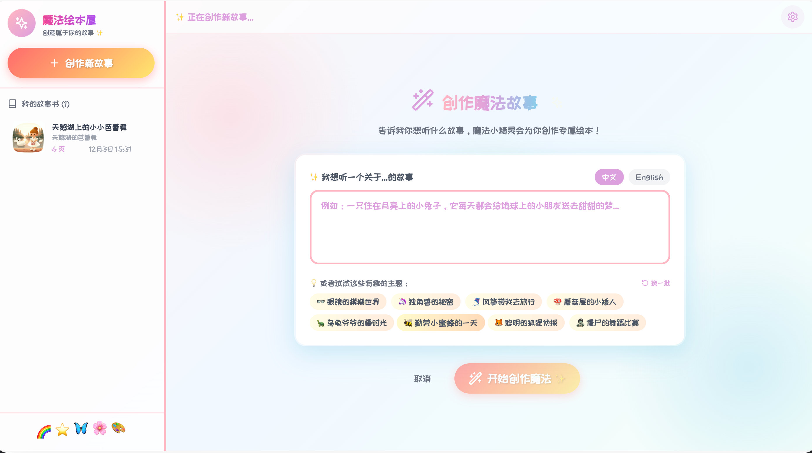
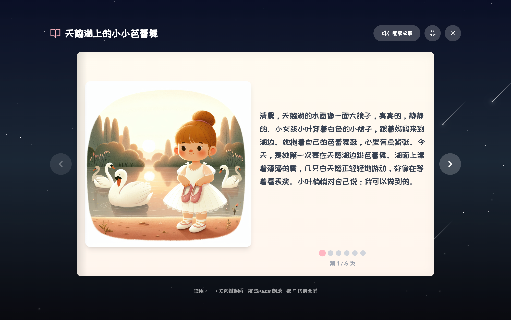

# 🎨 Magic Story Bar - AI绘本生成器

一款基于AI技术的儿童绘本生成应用，为3-8岁儿童创造神奇的故事体验。


## 📸 效果展示

<div align="center">
  
  
</div>

## ✨ 功能特性

- 🤖 **AI故事创作** - 输入主题，AI自动生成适合儿童的温馨故事
- 🎨 **智能插图生成** - 为每页故事自动生成精美的儿童绘本风格插图
- 🔊 **流式语音朗读** - 支持流式语音播放，边生成边朗读，极速响应
- 📱 **移动端适配** - 专为移动设备优化的阅读体验，支持触摸滑动翻页
- 🔒 **安全配置** - 支持加密导出/导入API配置，保护您的密钥安全
- 🌍 **多语言支持** - 支持中文和英文故事创作，辅助语言学习
- 📖 **绘本阅读模式** - 沉浸式翻页阅读体验
- 💾 **本地存储** - 故事自动保存，随时回顾
- ⚙️ **灵活配置** - 支持多种AI API配置

## 🛠️ 技术栈

- **前端框架**: React 18
- **构建工具**: Vite 5
- **样式方案**: Tailwind CSS
- **状态管理**: Zustand
- **图标库**: Lucide React

## 📦 安装

1. 克隆项目
```bash
git clone https://github.com/braverior/magic_story_bar.git
cd magic_story_bar
```

2. 安装依赖
```bash
npm install
```

3. 启动开发服务器
```bash
npm run dev
```

4. 打开浏览器访问 `http://localhost:3000`

## 🔧 配置

### API配置

点击右上角的设置图标 ⚙️ 进入设置面板，配置以下API：

#### 文本生成API
- **API Key**: 你的文本生成服务API密钥
- **API URL**: API端点地址（默认：`https://api.newapi.pro/v1`）
- **模型**: 使用的模型名称（默认：`gpt-4o-mini`）

#### 图片生成API
- **API Key**: 你的图片生成服务API密钥
- **API URL**: API端点地址（默认：`https://api.newapi.pro/v1`）
- **模型**: 使用的模型名称（默认：`dall-e-3`）

#### 语音合成API（可选）
- **API Key**: 你的TTS服务API密钥
- **API URL**: API端点地址
- **模型**: TTS模型（默认：`doubao-tts`）
- **音色**: 语音音色（默认：`zh_female_qingxin`）
  - **支持的音色**：
    - 清新女声 (`zh_female_qingxin`)
    - 醇厚男声 (`zh_male_chunhou`)
    - 知性女声 (`zh_female_zhixing`)
    - 亲切男声 (`zh_male_qinqie`)
    - 情感女声 (`en_female_emotional`)
    - 叙事男声 (`en_male_narrative`)

### 配置管理

在设置面板底部，你可以：
- **导出配置**: 支持导出为普通 JSON 文件或加密文件（.secure.txt），安全备份您的配置
- **导入配置**: 支持导入 JSON 或加密配置文件，方便在不同设备间安全同步
- **清除配置**: 一键清除所有本地保存的 API 配置

### 支持的API服务

- [NewAPI](https://newapi.pro/) - 聚合多种AI服务
- [火山引擎](https://www.volcengine.com/) - 豆包系列模型
- 其他兼容OpenAI格式的API服务

## 📖 使用方法

### 创建新故事

1. 点击侧边栏的 **"+ 创建新故事"** 按钮
2. 在输入框中输入故事主题（如："小兔子找朋友"、"森林里的音乐会"）
3. 选择故事语言（中文/英文）
4. 点击 **"开始创作"** 按钮
4. 等待AI生成故事内容和插图（通常需要1-2分钟）

### 阅读故事

1. 在侧边栏选择已创建的故事
2. 在故事详情页点击 **"开始阅读"** 进入绘本模式
3. 使用左右箭头或键盘方向键翻页
4. 点击喇叭图标可以听语音朗读
5. 按 `ESC` 键退出阅读模式

### 管理故事

- **查看故事**: 点击侧边栏中的故事卡片
- **删除故事**: 在故事卡片上点击删除按钮

## ⌨️ 快捷键

| 快捷键 | 功能 |
|--------|------|
| `←` / `→` | 阅读模式下翻页 |
| `ESC` | 退出阅读模式 / 关闭设置面板 |

## 📁 项目结构

```
magic_story_bar/
├── public/
│   ├── favicon.svg
│   └── images/
├── src/
│   ├── components/
│   │   ├── BookReader.jsx    # 绘本阅读器组件
│   │   ├── Settings.jsx      # 设置面板组件
│   │   ├── Sidebar.jsx       # 侧边栏组件
│   │   ├── StoryCreator.jsx  # 故事创建组件
│   │   ├── StoryView.jsx     # 故事详情组件
│   │   └── WelcomeScreen.jsx # 欢迎页组件
│   ├── services/
│   │   └── api.js            # API服务层
│   ├── store/
│   │   └── useStore.js       # Zustand状态管理
│   ├── App.jsx               # 主应用组件
│   ├── index.css             # 全局样式
│   └── main.jsx              # 应用入口
├── index.html
├── package.json
├── vite.config.js
├── tailwind.config.js
└── postcss.config.js
```

## 🚀 构建部署

### 构建生产版本
```bash
npm run build
```

### 预览生产版本
```bash
npm run preview
```

构建产物将生成在 `dist/` 目录下，可部署到任何静态托管服务。

### Docker 部署

#### 方式一：从 Docker Hub 安装（推荐）

1. 拉取镜像
```bash
docker pull imlele123/magic-story-bar:latest
```

2. 运行容器
```bash
docker run -d -p 80:80 imlele123/magic-story-bar:latest
```

#### 方式二：本地构建

1. 构建镜像
```bash
docker build -t magic-story-bar .
```

2. 运行容器
```bash
docker run -d -p 80:80 magic-story-bar
```

启动后，访问 `http://localhost` 即可使用。

## ⚠️ 注意事项

1. **API费用**: 使用AI服务会产生相应的API调用费用，请注意控制使用量
2. **网络要求**: 需要稳定的网络连接以调用AI服务
3. **图片存储**: 生成的图片URL会缓存在本地存储中，清除浏览器数据可能导致图片丢失
4. **内容审核**: AI生成的内容已针对儿童进行了提示词优化，但仍建议家长陪同使用

## 🤝 贡献

欢迎提交Issue和Pull Request来帮助改进这个项目！

## 📄 许可证

MIT License

---

💡 **提示**: 如果遇到API调用问题，请检查网络连接和API配置是否正确。
